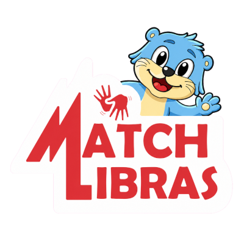

<h1 align="center">
  
</h1>

Repositorio do projeto Match Libras, o jogo foi criado com foco em crianças com deficiência auditiva, brincando de forma lúdica a relação entre objetos, números e sinais de libras

Para baixar a versão mais recente acesse [aqui](https://github.com/BarbosaRT/match-libras/releases/latest)

